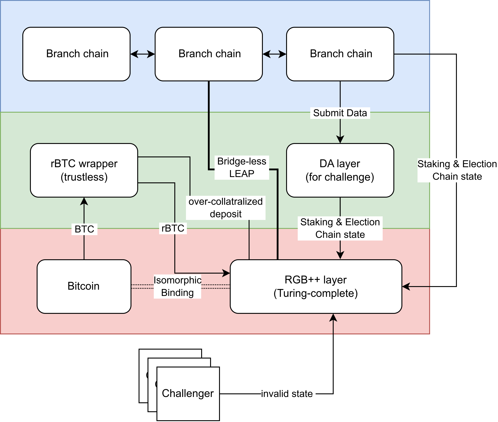

# Overview

For a long time, Bitcoin has lacked sufficient smart contract capabilities, making it difficult to achieve a wide range of applications. The inability to verify external transactions and states on Bitcoin has hindered the performance scalability. Most Bitcoin Layer 2 projects have adopted sidechain solutions to circumvent the challenges of implementing rich applications on Layer 1.

UTXO Stack adopts a different approach. Firstly, we introduced a Turing-complete program environment to Bitcoin Layer 1 with Single-use seal and Client-side validation technology. Secondly, with the Layer 1 programmability, we introduced a UTXO Layer 2 framework for everyone to build their own Bitcoin Layer 2, which is called Branch chain. Branch chain's security is guaranteed by the smart contract and collaterals on Layer 1.

## L1 programmability

[RGB++ layer](./rgbpp.md) is an isomorphic binding (IB) layer between Bitcoin and a Turing-complete UTXO chain. We use Nervos CKB as the IB target for now, will expand to Cardano, Fuel, and other qualified chains in the future.

Every RGB++ UTXO lives on Bitcoin has a bound UTXO on IB chain, which is Turing-complete. To operate the bound rich-state UTXO, one must spend the UTXO on Bitcoin first with a commitment embedded in OP_RETURN, and trigger the transaction on IB chain with the proof of Bitcoin TX.

## L2 scalability

It is permissionless to launch a PoS L2 UTXO chain, which is called **Branch chain**. Branch chains have the following features.

- High throughput and low latency
- UTXO based, Bitcoin wallet compatible
- Turing-complete smart contract environment along with RISC-V VM
- Use Bitcoin as the Layer 2 native coin to pay the transaction fee
- Native cross-chain capability for RGB++ assets without bridge
- Forced exit guaranteed even if both the L2 sequencers and the DA layer corrupted

## Cross-chain Leap

Cross-chain Leap is benefiting from the very native feature of UTXO model. For RGB++ assets minted on Bitcoin or Branch chains, they can Leap between each other without any bridge. The Leap operation is secure, permissionless, and decentralized.

## rBTC wrapper

Although the Leap feature is perfect for user-defined assets in the ecosystem, the BTC itself is unfortunately not a part of RGB++ assets. We cannot make BTC move to Branch chain without bridge. 

rBTC wrapper makes BTC into an RGB++ compatible asset. Different from most of other multisig bridges, rBTC wrapper is a capital efficient over-collateralized bridge. A set of smart contracts is running on RGB++ layer to monitor the operators. The operators' deposit will be slashed if they committed any kind of malicious actions. And the rBTC holders will get full compensation if the bridge operators collude to steal the locked BTC. **The security model of rBTC wrapper doesn't rely on the 2/3 honest assumption. Thus, the rBTC wrapper is a trustless and economic-secure bridge.**

## DA Layer

Branch chain must maintain the SPV client of self on the RGB++ layer of Bitcoin, as well as an RGB++ layer SPV client on themselves. Branch chain must publish full block data and upload it to the DA layer. Challengers are ready to check the consistency between the full block data and SPV client data. If there goes something wrong, challengers will provide the proof and slash the Branch chain sequencers. 

Data availability problem is one of the major challenges for L2. It is difficult to identify whether sequencers committed malicious actions or not if you don't have the full block data. We build the DA layer to alleviate this concern by forcing Branch chain sequencers to publish full data on it. But what if the DA layer is corrupted or compromised? 

## Forced exit

When the public DA source failed, people can still exit their assets from the Layer 2 Branch chains if they have the CSV historical data stored locally. That's another benefit from the nature of UTXO: UTXOs can prove themselves with a branch of historical UTXO spend chains. Typically, there are hundreds to thousands of ancestral transactions for one live UTXO, and it takes about 1~2M bytes storage.

One can use these CSV data to generate a compressed Merkelized proof to RGB++ layer to do the forced exit from Branch chains. After a certain period of challenging, if the user is honest, the proof will finally help their assets back to layer 1.
