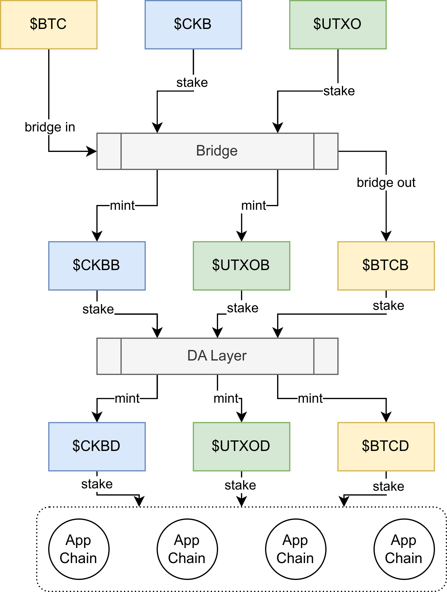

# Staking and Security

## 模块化安全

## Bitcoin Staking Bridge

该模块提供 btc 跨链安全，它是基于质押而不是信任的安全。一旦跨链桥作恶，用户可以 100% 得到偿还。质押在跨链桥的资金可以再质押到 DA Layer。该质押获得 $UTXO 奖励。质押后，用户可获得 $CKBB, $UTXOB 凭证。

## Challenge DA Layer

该模块提供 DA 安全，用户质押 $CKBB, $UTXOB, 和 $BTCB，该质押获得 $UTXO 奖励。质押后，用户可获得 $BTCDA, $CKBDA, $UTXODA 凭证。

## L2 Appchain

该模块提供 L2 出块安全，用户选择质押 $BTCDA, $CKBDA, $UTXODA 凭证，获得 $BTCB 奖励。